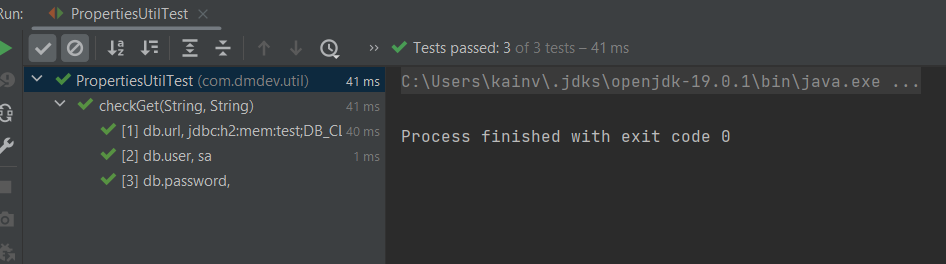
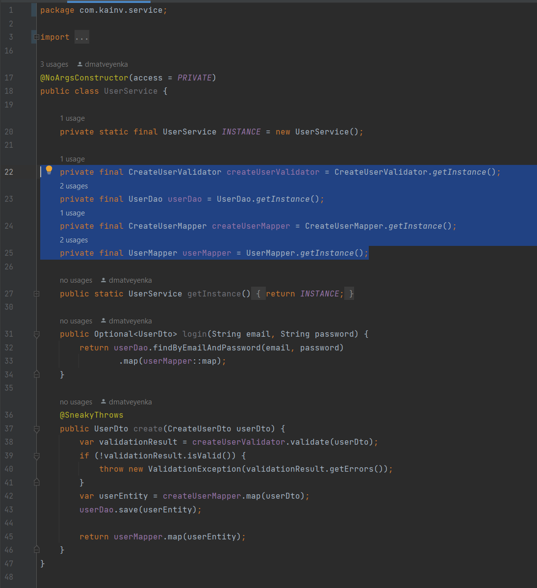
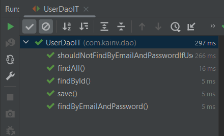

# JUnit 5. 21. Практика

Задание:
- Покрыть Unit и Integration тестами не менее 90% кода

Технические детали:
- Unit и Integration тесты должны запускаться в разных фазах жизненного цикла
- Чтобы реализовать Integration тесты, необходимо наследоваться от класса IntegrationTestBase
- Помнить про правильное именование Unit и Integration тестов (как классов, так и методов)
- Чтобы проверить процент покрытия тестами, можно воспользоваться jacoco плагином, либо средствами IntelliJ IDEA (Run with Coverage)

Введение
--------

Структура проекта
-----------------

Используется H2 база данных для того чтобы не настраивать никакие базы данных вручную. Т.е. она будет автоматически подниматься во время запуска тестов и автоматически удаляться после окончания их.

Используется обычная, лёгкая трёхтировая архитектура. Как помним, юнит и интеграционные тесты пишем только **на логику**, поэтому dto и entity нас особо не интересуют.

Начнём с описания юнит-тестов на классы без зависимостей (утилитные классы).

В `ConnectionManager` у нас идёт работа с базами данных поэтому нет смысла покрывать юнит-тестами наш `ConnectionManager`. Он автоматически будет покрыт с помощью интеграционных тестов когда будем писать на взаимодействие с базами данных.

LocalDateFormatter unit test
----------------------------

Этот класс отлично подходит, чтобы написать тест на два метода, которые он содержит.

### public LocalDate format(String date) {}

Напишем первый тест, который проверяет, что дата успешно форматируется:

        @Test
        void format() {
    //        ожидаемое значение: yyyy-MM-dd
            String date = "2020-11-28";

            LocalDate actualResult = LocalDateFormatter.format(date);

            assertThat(actualResult).isEqualTo(LocalDate.of(2020, 11, 28));
        }

Мы должны проверить ещё один тест-кейс, когда дата приходит в неправильном формате и если зайдём в метод `parse()` глубже, то увидим, что если данные будут невалидны, то у выбросится `DateTimeParseException`. Поэтому идём в наш класс и пишем:

    @Test
    void shouldThrowExceptionIfDateInvalid() {
        String date = "2020-11-28 12:25";

        assertThrows(DateTimeParseException.class, () -> LocalDateFormatter.format(date));
    }

### public boolean isValid(String date) {}

Здесь отличие в том, что мы в любом случае возвращаем boolean и обрабатываем исключение `DateTimeParseException` поэтому можем легко покрыть этот метод с помощью параметризованных тестов. Он отлично ложится под этот шаблон. Для начала создадим аргументы для этого параметризованного теста, а затем сам тест:

        @ParameterizedTest
        @MethodSource("getValidationArguments")
        void isValid(String date, boolean expectedResult) {
            boolean actualResult = LocalDateFormatter.isValid(date);
    
            assertEquals(expectedResult, actualResult);
        }
    
        static Stream<Arguments> getValidationArguments() {
            return Stream.of(
    //                Передаём значение и что ожидаем получить от тестируемого метода
                    Arguments.of("2020-11-28", true),
                    Arguments.of("01-01-2001", false),
                    Arguments.of("01-01-2001 12:25", false),
                    Arguments.of("2020-11-28 12:25", false),
                    Arguments.of(null, false)
            );
        }

Проверим, что все тесты выполняются:

PropertiesUtil unit test
------------------------

Здесь нас интересует только один метод - это `String get(String key)`. Остальной функционал является статическим и загружается во время загрузки пропертис утил класса в память JVM. Следовательно, мы можем проверить только метод `get()`.

### public static String get(String key) {}

Здесь мы можем покрыть этот тест при помощи параметризованного теста. Поэтому точно так же пишем сначала аргументы, а за тем сам тест. Значения для аргументов берём из пропертис файла:

    @ParameterizedTest
    @MethodSource("getPropertyArguments")
    void checkGet(String key, String expectedValue) {
        String actualResult = PropertiesUtil.get(key);

        assertEquals(expectedValue, actualResult);
    }

    static Stream<Arguments> getPropertyArguments() {
        return Stream.of(
                Arguments.of("db.url", "jdbc:h2:mem:test;DB\_CLOSE\_DELAY=-1"),
                Arguments.of("db.user", "sa"),
                Arguments.of("db.password", "")
        );
    }

CreateUserValidator unit test
-----------------------------

Он так же не содержит никаких зависимостей. В методе который будем тестировать `validate()` есть три if'а, который должны каждый из них проверить для того чтобы 100% было покрытие тестами и так же есть вариант, что `validationResult` будет хранить несколько ошибок если сразу же несколько валидаций не прошло. Отсюда приходим к выводу, что есть сразу несколько разных тест-кейсов: три из них на каждый из if'ов, один на success result (когда валидация прошла успешно) и пятый тест-кейс - когда мы в `validationResult` содержим сразу же несколько ошибок.

### public ValidationResult validate(CreateUserDto object)

Обычно, если это не утилитный класс, то тестируемый класс создаётся как поле в тестовом классе. Т.е. пишем:

    class CreateUserValidatorTest {
        private final CreateUserValidator validator = CreateUserValidator.getInstance();
    }

Или через new, если класс не синглтон, или если нет DI фреймворка. В любом случае валидатор не содержит состояния. Наша задача - всего лишь создать объект этого класса и представить его в виде поля тестового класса.

Как говорили - нужно три тест-кейса для каждого из if. Начнём с ситуации когда Dto валидное:

    @Test
    void shouldPassValidation() {
        CreateUserDto dto = CreateUserDto.builder()
                .name("Ivan")
                .email("test@gmail.com")
                .password("123")
                .birthday("2000-01-01")
                .role(Role.USER.name())
                .gender(Gender.MALE.name())
                .build();

        ValidationResult actualResult = validator.validate(dto);

        assertFalse(actualResult.hasErrors());
    }

Запускаем и проверяем:

Осталось написать тест-кейсы где будут какие-то ошибки. В первом случае проверим неправильный формат дня рождения:

        @Test
        void invalidBirthday() {
            CreateUserDto dto = CreateUserDto.builder()
                    .name("Ivan")
                    .email("test@gmail.com")
                    .password("123")
                    .birthday("2000-01-01 12:23")
                    .role(Role.USER.name())
                    .gender(Gender.MALE.name())
                    .build();

            ValidationResult actualResult = validator.validate(dto);

    //        Ровно одна ошибка потому что все остальные поля правильные
            assertThat(actualResult.getErrors()).hasSize(1);
    //        Проверяем какая именно ошибка, т.е. что это ошибка именно связанная с др
            assertThat(actualResult.getErrors().get(0).getCode()).isEqualTo("invalid.birthday");
        }

Проверим ещё на неправильный гендер:

        @Test
        void invalidGender() {
            CreateUserDto dto = CreateUserDto.builder()
                    .name("Ivan")
                    .email("test@gmail.com")
                    .password("123")
                    .birthday("2000-01-01")
                    .role(Role.USER.name())
                    .gender("fake")
                    .build();

            ValidationResult actualResult = validator.validate(dto);

    //        Ровно одна ошибка потому что все остальные поля правильные
            assertThat(actualResult.getErrors()).hasSize(1);
    //        Проверяем какая именно ошибка, т.е. что это ошибка именно связанная с др
            assertThat(actualResult.getErrors().get(0).getCode()).isEqualTo("invalid.gender");
        }

Проверим на роль:

        @Test
        void invalidRole() {
            CreateUserDto dto = CreateUserDto.builder()
                    .name("Ivan")
                    .email("test@gmail.com")
                    .password("123")
                    .birthday("2000-01-01")
                    .role("fake")
                    .gender(Gender.MALE.name())
                    .build();

            ValidationResult actualResult = validator.validate(dto);

    //        Ровно одна ошибка потому что все остальные поля правильные
            assertThat(actualResult.getErrors()).hasSize(1);
    //        Проверяем какая именно ошибка, т.е. что это ошибка именно связанная с др
            assertThat(actualResult.getErrors().get(0).getCode()).isEqualTo("invalid.role");
        }

И последнее - это совокупность нескольких ошибок:

        @Test
        void invalidRoleGenderBirthday() {
            CreateUserDto dto = CreateUserDto.builder()
                    .name("Ivan")
                    .email("test@gmail.com")
                    .password("123")
                    .birthday("01-01-200")
                    .role("fake\_role")
                    .gender("fake\_gender")
                    .build();
    
            ValidationResult actualResult = validator.validate(dto);
    
    //        Ожидаем три ошибки
            assertThat(actualResult.getErrors()).hasSize(3);
    //        Получаем все ошибки
            List<String> errorCodes = actualResult.getErrors().stream()
                    .map(Error::getCode)
                    .toList();
    //        В contains() в любом порядке перечисляем ожидаемые значения
            assertThat(errorCodes).contains("invalid.role", "invalid.gender", "invalid.birthday");
        }

Запускаем и проверяем:

CreateUserMapper unit test
--------------------------

Он тоже не содержит никаких зависимостей и тоже можем получить объект этого класса через `getInstance` и в нем есть один единственный метод: `map()`. Он только преобразовывает dto в сущность - достаточно написать один метод, который принимает на вход dto и возвращает сущность потому что в нем нет никакой логики. Более того - `LocaDateFormatter` мы так же уже проверили с помощью отдельного юнит-теста. Поэтому не нужно создавать тест для `CreateUserMapper`'a который проверяет различные даты рождения.

### public User map(CreateUserDto object) {}

Если часто используем какую-ту часть из **given** шага, то можно вынести в отдельный utils класс, но это лучше делать только тогда, когда создание объекта является трудоёмким процессом.

    class CreateUserMapperTest {

        private final CreateUserMapper mapper = CreateUserMapper.getInstance();

        @Test
        void map() {
            CreateUserDto dto = CreateUserDto.builder()
                    .name("Ivan")
                    .email("test@gmail.com")
                    .password("123")
                    .birthday("2000-01-01")
                    .role(Role.USER.name())
                    .gender(Gender.MALE.name())
                    .build();

            User actualResult = mapper.map(dto);

            User expectedResult = User.builder()
                    .name("Ivan")
                    .email("test@gmail.com")
                    .password("123")
                    .birthday(LocalDate.of(2000, 1, 1))
                    .role(Role.USER)
                    .gender(Gender.MALE)
                    .build();

            assertThat(actualResult).isEqualTo(expectedResult);
        }
    }

Писать тест на `UserMapper` не будем поскольку он идентичен.

UserService unit test
---------------------

Этот класс содержит множество других зависимых классов поэтому этот кейс нас будет интересовать больше потому что при написании юнит-теста нам необходимо каким-то образом за-mock-ать все внешние зависимости. Поэтому нам и понадобится мокито-зависимость потому что в юнит тестах не должен вызываться функционал из зависимых классов. Потому что все эти зависимые классы мы будем покрывать отдельно. Мы уже покрыли отдельно `CreateUserValidator`, `CreateUserMapper` и скоро покроем `UserDao`. Поэтому нам не нужно вызывать их всех, для этого у нас есть интеграционные тесты которые проверят интеграцию между различными компонентами в системе.

Пока создадим тест и попробуем покрыть тестами наш метод `login()`, в котором есть два тест-кейса: первый это - нахождение пользователя успешно по email и password после чего преобразовываем сущность в соответствующее Dto и второй тест-кейс - это когда не нашли пользователя и `userMapper` не вызвался и мы получили `Optional.empty()`.

Сначала создаём `private UserService userService;` в который должны будем внедрять зависимости. Все эти объекты, которые будем внедрять должны быть mock'ами, а не реальными. Поэтому воспользуемся `@ExtendWith(MockitoExtension.class)`. После того как над нужными объектами поставили аннотацию `@Mock` - наш Extension будет автоматически подготавливать этот мок и чистить все его stub'ы перед каждым вызовом нового теста. Поэтому нам не нужно заниматься этим вручную.

    @ExtendWith(MockitoExtension.class)
    class UserServiceTest {

        @Mock
        private CreateUserValidator createUserValidator;
        @Mock
        private UserDao userDao;
        @Mock
        private CreateUserMapper createUserMapper;
        @Mock
        private UserMapper userMapper;

        @InjectMocks
        private UserService userService;

        @Test
        void login() {
        }
    }

Используем `@InjectMocks` аннотацию которая внедрит моки за нас. Опять же благодаря MockitoExtension. Именно этот Extension анализирует все эти аннотации и подготавливает объекты и моки за нас.

### public Optional<UserDto> login(String email, String password) {}

Теперь у нас есть два тест-кейса для логин: это `void loginSuccess()` и `void loginFailed()`.

Теперь проверяем, что за Dto в нашем Optional. Для того чтобы получить этот dto - мы должны в userService заставить второй объект userMapper для того чтобы не вызывался реальный объект. Потому что это юнит тест. Мы должны подготовить UserDto и заставить так же как заставили UserDao.

        @Test
        void loginSuccess() {
            User user = User.builder()
                    .id(99)
                    .name("Ivan")
                    .email("test@gmail.com")
                    .password("123")
                    .birthday(LocalDate.of(2000, 1, 1))
                    .role(Role.USER)
                    .gender(Gender.MALE)
                    .build();
            UserDto userDto = UserDto.builder()
                    .id(99)
                    .name("Ivan")
                    .email("test@gmail.com")
                    .role(Role.USER)
                    .build();
            doReturn(Optional.of(user)).when(userDao).findByEmailAndPassword(user.getEmail(), user.getPassword());
            doReturn(userDto).when(userMapper).map(user);
    
            Optional<UserDto> actualResult = userService.login(user.getEmail(), user.getPassword());
    
    //        Проверяем, что такой объект есть в нашем Optional
            assertThat(actualResult).isPresent();
            assertThat(actualResult.get()).isEqualTo(userDto);
        }

**Если вызвать тест, то он не сработает потому что в базе данных ещё нет необходимых данных**.

Вынесем given часть в отдельные методы:

    private static UserDto getUserDto() {
        return UserDto.builder()
                .id(99)
                .name("Ivan")
                .email("test@gmail.com")
                .role(Role.USER)
                .birthday(LocalDate.of(2000, 1, 1))
                .gender(Gender.MALE)
                .build();
    }

    private static User getUser() {
        return User.builder()
                .id(99)
                .name("Ivan")
                .email("test@gmail.com")
                .password("123")
                .birthday(LocalDate.of(2000, 1, 1))
                .role(Role.USER)
                .gender(Gender.MALE)
                .build();
    }

Теперь реализовываем `void loginFailed()`. Здесь все очень похоже: мы должны за-stub'ить UserDao (поставить заглушку), только он не должен возвращать пользователя. Он должен вернуть `Optional.empty()`. Поэтому так и пишем:

        @Test
        void loginFailed() {
    //        Нам все равно какие логины и пароли поэтому пишем any()
            doReturn(Optional.empty()).when(userDao).findByEmailAndPassword(any(), any());

    //        TODO: Почему бы тут тоже any() не поставить?
            Optional<UserDto> actualResult = userService.login("dummy", "123");

            assertThat(actualResult).isEmpty();

    //        Дальше проверяем, что наш userMapper не был вызван в методе login userService'а, если не было никакого юзера
            verifyNoInteractions(userMapper);
        }

### public UserDto create(CreateUserDto userDto) {}

Опять же, как минимум один тест кейс это удачный сценарий. Мы должны его писать всегда. Т.е. когда ожидаем какая логика будет вызываться в подавляющем большинстве случаев. Следственно, мы должны передать валидный `UserDto` который будет отвалидирован, ошибок не будет. Далее оно будет преобразовано в сущность, эта сущность будет сохранена и возвращена как Dto.

Далее, второй вариант - когда буду ошибки и мы получим исключение `ValidationException`. Это два основных варианта развития событий в методе `create()`. Есть другие проблемы, например с базами данных (недоступна) или какие-то проблемы были в `createUserMapper`'е, но это уже более редкие случаи и их необязательно покрывать. В нашем случае покроем два тест-кейса.

        @Test
        void create() {
            CreateUserDto createUserDto = getCreateUserDto();
            User user = getUser();
            UserDto userDto = getUserDto();
    //        Возвращаем пустой ValidationResult когда в createUserValidator проверяем createUserDto
            doReturn(new ValidationResult()).when(createUserValidator).validate(createUserDto);
            doReturn(user).when(createUserMapper).map(createUserDto);
            doReturn(userDto).when(userMapper).map(user);

            UserDto actualResult = userService.create(createUserDto);

            assertThat(actualResult).isEqualTo(userDto);
    //        Проверяем, что вызвался метод save(). По логике он и так уже вызван на этапе return userMapper.map(),
    //        но со временем логика может измениться и все равно лучше написать verify на userDao.save()
            verify(userDao).save(user);
        }

        private static CreateUserDto getCreateUserDto() {
            return CreateUserDto.builder()
                    .name("Ivan")
                    .email("test@gmail.com")
                    .password("123")
                    .birthday("2000-01-01")
                    .role(Role.USER.name())
                    .gender(Gender.MALE.name())
                    .build();
        }

Теперь напишем тест-кейс в случае, если валидация не пройдена:

        @Test
        void shouldThrowExceptionIfDtoInvalid() {
            CreateUserDto createUserDto = getCreateUserDto();
    //        Возвращаем ValidationResult с ошибкой
            ValidationResult validationResult = new ValidationResult();
            validationResult.add(Error.of("invalid.role", "message"));
            doReturn(validationResult).when(createUserValidator).validate(createUserDto);

            assertThrows(ValidationException.class, () -> userService.create(createUserDto));
    //        Проверяем, что не было никаких взаимодействий с другими объектами в UserService потому что валидация не прошла
    //        и следовательно, не mapper'ы, не сохранение в БД не должно было произойти
            verifyNoInteractions(userDao, createUserMapper, userMapper);
        }

UserDao integration test
------------------------

Если мы посмотрим, то `UserDao` непосредственно взаимодействует с базами данных с помощью JDBC и покрыть этот класс с помощью юнит-тестов не совсем целесообразно и в принципе невозможно поскольку используются различные утилитные статические методы. Их за-mock'ать не можем. Поэтому результат один: должны покрыть `UserDao` только интеграционными тестами потому что этот тест работает только с базами данных. Поэтому от юнит тестов тут будет мало толку. Поэтому создадим интеграционный тест вместе юнит.

    class UserDaoIT {

        @Test
        void findAll() {
        }

        @Test
        void findById() {
        }

        @Test
        void save() {
        }

        @Test
        void findByEmailAndPassword() {
        }

        @Test
        void delete() {
        }

        @Test
        void update() {
        }
    }

Для того чтобы этот тест был интеграционным, подготовлен специальный `IntegrationTestBase` класс, где будет происходить поднятие базы данных и перед всеми тестами будет создаваться таблица USER. И перед началом каждого теста мы будем просто чистить эту таблицу. Поэтому нам нужно наследоваться от `IntegrationTestBase`.

        class UserDaoIT extends IntegrationTestBase {}

Теперь как обычно проверяем `UserDao`. Сначала внедряем зависимости посредством агрегации.

        private final UserDao userDao = UserDao.getInstance();

Если бы не было реализации паттерна синглтон, то мы бы использовали либо создание вручную `new UserDao()`, либо прибегнули бы к DI-фреймворку.

### public List<User> findAll()

Для того чтобы проверить `findAll()`, в базе данных что-то должно быть и это секция given. Мы в секции given должны сохранить в базу какие-то значения. А, для того чтобы сохранить, мы должны воспользоваться `userDao.save()`, который так же должны проверить.

        @Test
        void findAll() {
            User user1 = userDao.save(getUser("test1@gmail.com"));
            User user2 = userDao.save(getUser("test2@gmail.com"));
            User user3 = userDao.save(getUser("test3@gmail.com"));
    
            List<User> actualResult = userDao.findAll();
    
            assertThat(actualResult).hasSize(3);
    //        Если результат равен трём, то должны проверить, что внутри этого списка
    //        Проверим, что в результате находятся необходимые нам ид
            List<Integer> userIds = actualResult.stream()
                    .map(User::getId)
                    .toList();
            assertThat(userIds).contains(user1.getId(), user2.getId(), user3.getId());
        }

### public Optional<User> findById(Integer id) {}

        @Test
        void findById() {
            User user1 = userDao.save(getUser("test1@gmail.com"));
    
            Optional<User> actualResult = userDao.findById(user1.getId());
    
    //        Проверяем, что юзер существует
            assertThat(actualResult).isPresent();
    //        Сравниваем полностью объекты
            assertThat(actualResult.get()).isEqualTo(user1);
    
        }

### public User save(User entity) {}

        @Test
        void save() {
            User user = getUser("test1@gmail.com");

            User actualResult = userDao.save(user);

    //        Проверяем, есть ли ид у пользователя. Если есть, то пользователь существует.
    //        Используем assertNotNull потому что не знаем какой ид будет
            assertNotNull(actualResult.getId());
        }

Метод `save()` также переиспользовали в других тестовых классах, но в них не проверяли, что метод save работает поскольку есть отдельный тестовый метод, который проверяет что `save()` отрабатывает успешно. Поэтому в тестовых классах переиспользуем его. Это тоже нормально, не нужно делать дополнительные ассерты что у юзера после метода `save()` действительно есть ид (т.е. что действительно есть в базах данных). Потому что каждый тестовый метод проверяет ровно 1 тест-кейс.

### public Optional<User> findByEmailAndPassword(String email, String password) {}

В данном случае у нас будет два варианта - это то, что юзер был найден по email и паролю и когда его не было. Следовательно, будет второй тестовый кейс `void shouldNotFindByEmailAndPasswordIfUserDoesNotExist`

    @Test
    void findByEmailAndPassword() {
        User user = userDao.save(getUser("test1@gmail.com"));

        Optional<User> actualResult = userDao.findByEmailAndPassword(user.getEmail(), user.getPassword());
        
        assertThat(actualResult).isPresent();
        assertThat(actualResult.get()).isEqualTo(user);
    }
    

    @Test
    void shouldNotFindByEmailAndPasswordIfUserDoesNotExist() {
        User user = userDao.save(getUser("test1@gmail.com"));

        Optional<User> actualResult = userDao.findByEmailAndPassword("dummy", "123");

        assertThat(actualResult).isEmpty();
    }

Проверим, что тесты отрабатывают:

### public boolean delete(Integer id) {}

В этом методе у нас несколько тест-кейсов. То, что удаляем существующую сущность и должен вернуть true и то, что удаляем несуществующую сущность и должен быть false.

    @Test
    void deleteExistingEntity() {
        User user = userDao.save(getUser("test1@gmail.com"));

        boolean actualResult = userDao.delete(user.getId());

        assertTrue(actualResult);
    }
    

    @Test
    void deleteNotExistingEntity() {
        userDao.save(getUser("test1@gmail.com"));

        boolean actualResult = userDao.delete(100500);

        assertFalse(actualResult);
    }

### public void update(User entity) {}

        @Test
        void update() {
            User user = getUser("test1@gmail.com");
            userDao.save(user);
            user.setName("Ivan-updated");
            user.setPassword("new\_password");

            userDao.update(user);

    //        Проверяем изменение пользователя при помощи findById()
            User updatedUser = userDao.findById(user.getId()).get();
            assertThat(updatedUser).isEqualTo(user);
        }

Вызовем все наши тесты и проверим что они работают:

UserService integration test
----------------------------

Так как мы UserService покрыли уже юнит-тестами, то нам не нужно покрывать все те же самые тест-кейсы с помощью интеграционных. Потому что юнит-тесты занимают большую часть тестов в приложениях. Напишем интеграционный тест на UserService.

    class UserServiceIT extends IntegrationTestBase {
        private UserService userService = new UserService();
    }

Создание этого объекта вручную без DI-фреймворков занимает много места. Поэтому вынесем его создание в `@BeforeEach`:

    class UserServiceIT extends IntegrationTestBase {

        private UserDao userDao;
        private UserService userService;

        @BeforeEach
        void init() {
            userDao = UserDao.getInstance();
            userService = new UserService(
                    CreateUserValidator.getInstance(),
                    userDao,
                    CreateUserMapper.getInstance(),
                    UserMapper.getInstance()
            );
        }
    }

### public Optional<UserDto> login(String email, String password) {}

Для логина нам нужно подготовить пользователя. Следовательно, возьмем пользователя из `UserDaoIT`:

        @Test
        void login() {
            User user = userDao.save(getUser("test@gmail.com"));
    
    //        Проверяем, что метод login() вернёт пользователя, если передадим email и пароль
            Optional<UserDto> actualResult = userService.login(user.getEmail(), user.getPassword());
    
            assertThat(actualResult).isPresent();
            assertThat(actualResult.get().getId()).isEqualTo(user.getId());
        }
    
        private User getUser(String email) {
            return User.builder()
                    .name("Ivan")
                    .email(email)
                    .password("123")
                    .birthday(LocalDate.of(2000, 1, 1))
                    .role(Role.USER)
                    .gender(Gender.MALE)
                    .build();
        }

Таким образом убеждаемся, что тот пользователь, который мы сохранили и ожидаем получить по email и паролю действительно был получен и он хранится в `userDto`.

### public UserDto create(CreateUserDto userDto) {}

        @Test
        void create() {
            CreateUserDto createUserDto = getCreateUserDto();

            UserDto actualResult = userService.create(createUserDto);

    //        Проверяем, что у нашего пользователя есть ид, т.е. подразумеваем существование пользователя
            assertNotNull(actualResult.getId());
        }

        private CreateUserDto getCreateUserDto() {
            return CreateUserDto.builder()
                    .name("Ivan")
                    .email("test@gmail.com")
                    .password("123")
                    .birthday("2000-01-01")
                    .role(Role.USER.name())
                    .gender(Gender.MALE.name())
                    .build();
        }

Проверяем, что все тесты:

Проверка покрытия классов тестами
---------------------------------

Мы можем с помощью maven запустить весь жизненный цикл и проверить сколько процентов покрытия тестов мы сделали. Это `mvn verify`, который запустит юнит и интеграционные тесты в отдельных фазах (смотреть target/site/index.html там будет отчёт):

